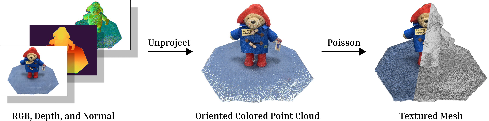

# AtomGS: Atomizing Gaussian Splatting for High-Fidelity Radiance Field

[Project page](https://rongliu-leo.github.io/AtomGS/) | [Paper](https://arxiv.org/pdf/2405.12369) | [Video](https://www.youtube.com/watch?v=1B7oga_1BqE) | [Viewer Pre-built for Windows](https://drive.google.com/file/d/1DRFrtFUfz27QvQKOWbYXbRS2o2eSgaUT/view?usp=sharing)


This repo contains the official implementation for the paper "[AtomGS: Atomizing Gaussian Splatting for High-Fidelity Radiance Field](https://arxiv.org/pdf/2405.12369)". Our work builds upon [3DGS](https://github.com/graphdeco-inria/gaussian-splatting?tab=readme-ov-file) and [GS Monitor](https://github.com/RongLiu-Leo/Gaussian-Splatting-Monitor) codebases.

## Installation

### Environment
This codebase builds upon the 3DGS repository and maintains compatibility with it. Therefore, if you want to set up the repository smoothly, we strongly advise you to explore the [video tutorial](https://www.youtube.com/watch?v=UXtuigy_wYc) and the [FAQ section](https://github.com/graphdeco-inria/gaussian-splatting?tab=readme-ov-file#faq) from [3DGS](https://github.com/graphdeco-inria/gaussian-splatting?tab=readme-ov-file). This may help you identify if your concern is a known issue and, ideally, lead you to a solution.
```shell
git clone --single-branch --branch main https://github.com/RongLiu-Leo/AtomGS.git
cd AtomGS
conda env create --file environment.yml
conda activate AtomGS
```
### Viewer
The Pre-built Viewer for Windows can be found [here](https://drive.google.com/file/d/1DRFrtFUfz27QvQKOWbYXbRS2o2eSgaUT/view?usp=sharing). If you use Ubuntu or you want to check the viewer usage, please refer to [GS Monitor](https://github.com/RongLiu-Leo/Gaussian-Splatting-Monitor).

## Scripts

### Prepare the data
Adjust the data into the format like:
```
<location>
|---input
    |---<image 0>
    |---<image 1>
    |---...
```
Then run
```
python convert.py -s <location> [--resize] #If not resizing, ImageMagick is not needed
```

### Lauch the Viewer
```shell
<path to downloaded/compiled viewer>/bin/SIBR_remoteGaussian_app_rwdi.exe
```
### Train an AtomGS Model

https://github.com/RongLiu-Leo/AtomGS/assets/102014841/65dc3d7a-5062-4aa0-82e0-2250a6fc90ea


```shell
python train.py -s <path to COLMAP or NeRF Synthetic dataset>
```
For object-centered or masked datasets, if there is no large background, we advise using a dense representation to achieve better geometry accuracy.
```shell
python train.py -s <path to COLMAP or NeRF Synthetic dataset> --scaling_lr 0 --iteration 7000
```
**Some Tips**

1. When facing OOM problem, try to reduce ```--warm_up_until```
2. If you observe an oversmooth problem, try to reduce ```--lambda_normal```; If you think the geometry is still noisy, try to increase ```--lambda_normal```.
<details>
<summary><span style="font-weight: bold;">Important Command Line Arguments for train.py</span></summary>

  #### --source_path / -s
  Path to the source directory containing a COLMAP or Synthetic NeRF data set.
  #### --model_path / -m 
  Path where the trained model should be stored (```output/<random>``` by default).
  #### --prune_threshold
  Threshold is used to prune the Gaussians whose opacity falls below this value.
  #### --clone_threshold
  Threshold is used to clone the Gaussians whose positonal gradient exceeds this value.
  #### --split_threshold
  Threshold is used to split the Gaussians whose positonal gradient exceeds this value.
  #### --atom_proliferation_until
  Iteration where Atom Proliferation stops.
  #### --warm_up_until
  Iteration where warm-up strategy stops.
  #### --lambda_ms_ssim
  Influence of MS-SSIM Loss.
  #### --lambda_normal
  Influence of Edge-Aware Normal Loss.
  #### --atom_init_quantile
  The percentile of Atom Scale initialization.

</details>
<br>


### View the Trained Model
```shell
python view.py -s <path to COLMAP or NeRF Synthetic dataset> -m <path to trained model> 
```
<details>
<summary><span style="font-weight: bold;">Important Command Line Arguments for view.py</span></summary>

  #### --source_path / -s
  Path to the source directory containing a COLMAP or Synthetic NeRF data set.
  #### --model_path / -m 
  Path where the trained model should be stored (```output/<random>``` by default).
  #### --iteration
  Specifies which of iteration to load.

</details>
<br>

### Render the Trained Model
```shell
python render.py -s <path to COLMAP or NeRF Synthetic dataset> -m <path to trained model> 
```
<details>
<summary><span style="font-weight: bold;">Important Command Line Arguments for render.py</span></summary>

  #### --source_path / -s
  Path to the source directory containing a COLMAP or Synthetic NeRF data set.
  #### --model_path / -m 
  Path where the trained model should be stored (```output/<random>``` by default).
  #### --render_mode
  Specifies which map to render (```rgb``` by default).

</details>
<br>

### Export Poisson Mesh from the Trained Model

```shell
python export.py -s <path to COLMAP or NeRF Synthetic dataset> -m <path to GS model>
```

<details>
<summary><span style="font-weight: bold;">Important Command Line Arguments for export.py</span></summary>

  #### --source_path / -s
  Path to the source directory containing a COLMAP or Synthetic NeRF data set.
  #### --model_path / -m 
  Path where the trained model should be stored (```output/<random>``` by default).
  #### --iteration
  Specifies which of iteration to load (```7000``` by default).
  #### --downsample
  Downsample ratio for fusing RGB, depth, and normal maps to Poisson Mesh.
  #### --depth_threshold
  Threshold is used to cut off the background.
  #### --poisson_depth
  The maximum possible depth of the octree used in Poisson Mesh Extraction.

</details>
<br>

## Citation
If you find our code or paper helps, please consider giving us a star or citing:
```bibtex
@misc{liu2024atomgs,
    title={AtomGS: Atomizing Gaussian Splatting for High-Fidelity Radiance Field}, 
    author={Rong Liu and Rui Xu and Yue Hu and Meida Chen and Andrew Feng},
    year={2024},
    eprint={2405.12369},
    archivePrefix={arXiv},
    primaryClass={cs.CV},
    url={https://rongliu-leo.github.io/AtomGS/}
}
```

## License

This project is licensed under the Gaussian-Splatting License - see the [LICENSE](LICENSE.md) file for details.
